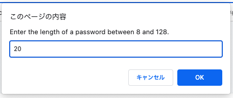
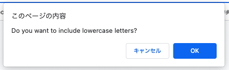
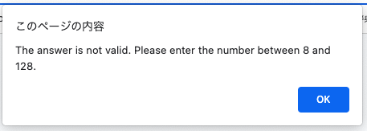
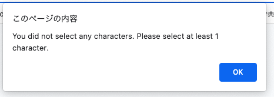
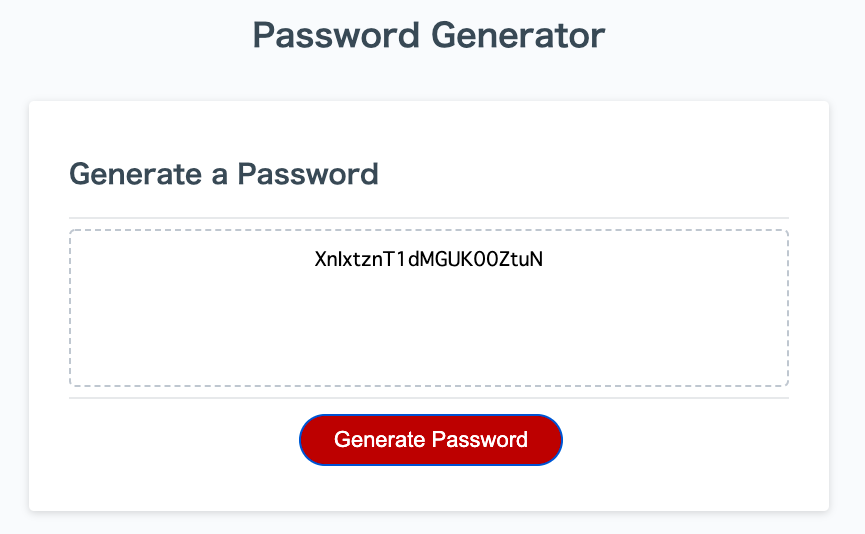
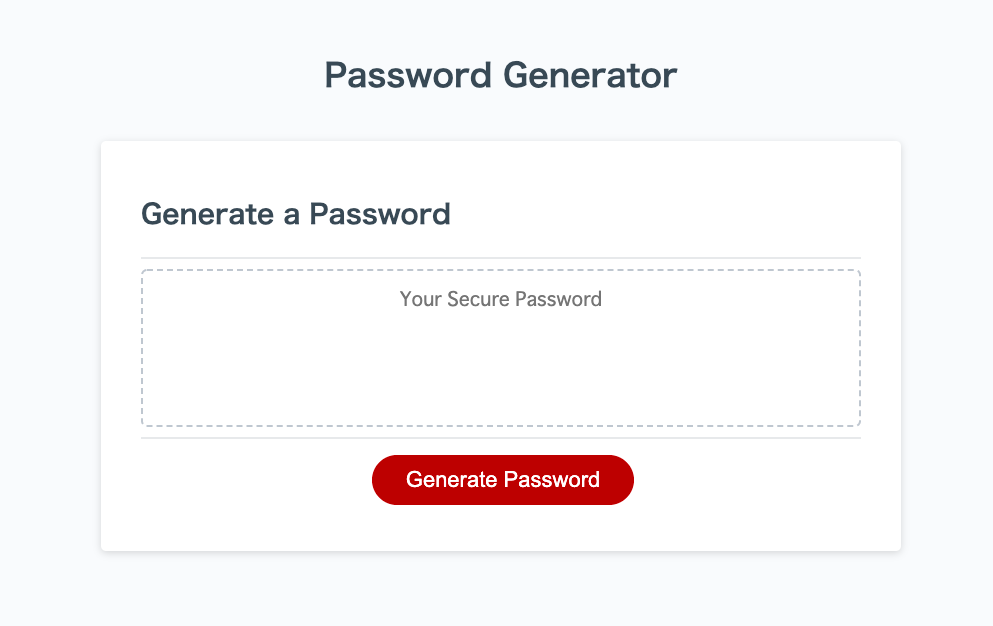

# Password-Generator

# Purpose
This password generator is to create a strong password that meets certain criteria in order to access sensitive data.

## Description
* Password criteria can be selected as follows:
    * Length: 8 to 128 characters
    * Characters: lowercase letters, uppercase letters, numbers, special characters
      (Need to choose more than 1 character type.)
    
* Criteria can be assigned when "Generate Password" button is clicked showing prompts which asks each criteria one by one.
    Examples:
    
    
* If invalid number entered or no character type chosen, it returns an error and closes the prompt.
    Examples:
    
    
* Password will be generated after all the questions are answered and be shown in the textbox.
    Example:
    

## Built With
* HTML
* CSS
* JavaScript

## Website
https://yurii92.github.io/password-generator/

## Contribution
Made with ❤️ by Yuri Ichikawa